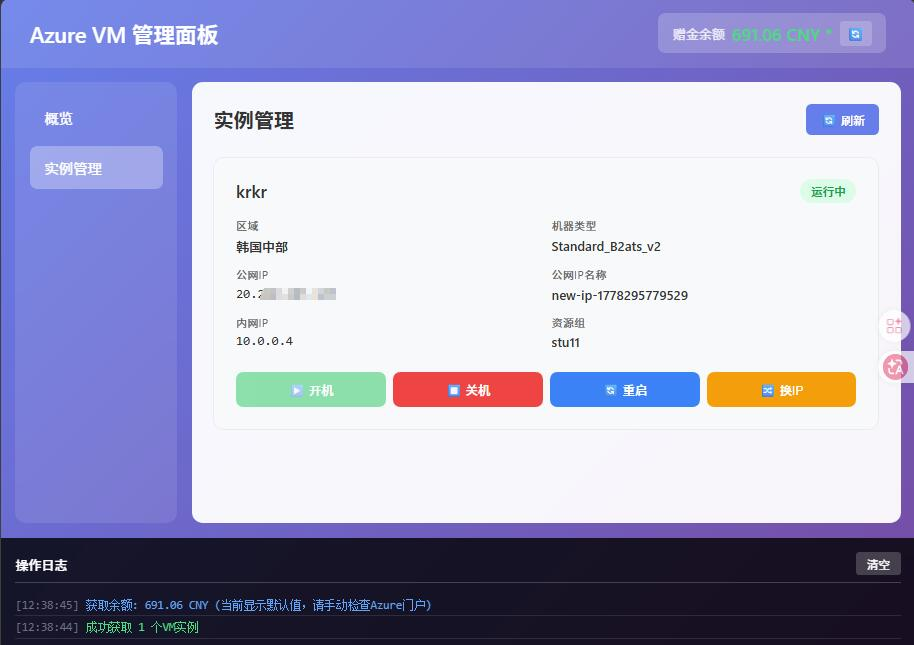

# Azure VM Manager

一个轻量级的 Azure 云实例管理服务，支持通过网页界面管理 Azure 虚拟机实例，包括开机、关机、重启和更换公网IP等功能。



## 功能特性

- ✅ VM 实例列表展示
- ✅ 启动/停止/重启 VM
- ✅ 更换公网 IP 地址
- ✅ 查看 VM 详细信息（区域、IP地址、资源组等）
- ✅ 赠金余额显示
- ✅ 操作日志记录
- ✅ 多账户支持（配置文件）

## 技术栈

- **后端**: Node.js + Express
- **前端**: HTML + CSS + JavaScript
- **API**: Azure REST API
- **认证**: Service Principal

## 快速开始

### 环境要求

- Node.js >= 20.x
- Azure 订阅（学生订阅或正式订阅）
- Azure Service Principal（需要 Contributor 权限）

### 安装依赖

```bash
npm install
```

### 配置文件

编辑 `config.yaml`，填写您的 Azure Service Principal 信息：

```yaml
azure:
  tenant_id: "your-tenant-id"
  client_id: "your-client-id"
  client_secret: "your-client-secret"
  subscription_id: "your-subscription-id"

defaults:
  resource_group: "your-resource-group"
  location: "your-location"
```

### 本地运行

```bash
npm start
```

访问 <http://localhost:3000>

## Docker 部署

### 使用 Docker Compose

```bash
## 1. 复制示例配置
cp config.example.yaml config.yaml
## 2. 编辑配置文件
vim config.yaml
## 3.启动
docker-compose up -d
```

### 手动构建

```bash
docker build -t azure-vm-manager .
## 1. 复制示例配置
cp config.example.yaml config.yaml
## 2. 编辑配置文件
vim config.yaml
## 3.启动
docker run -d -p 3000:3000 -v $(pwd)/config.yaml:/app/config.yaml --name azure-vm-manager azure-vm-manager
```

## API 接口

| 接口                        | 方法   | 说明         |
| ------------------------- | ---- | ---------- |
| `/api/vms`                | GET  | 获取所有 VM 列表 |
| `/api/vm/:name`           | GET  | 获取单个 VM 详情 |
| `/api/vm/:name/start`     | POST | 启动 VM      |
| `/api/vm/:name/stop`      | POST | 停止 VM      |
| `/api/vm/:name/restart`   | POST | 重启 VM      |
| `/api/vm/:name/change-ip` | POST | 更换公网 IP    |
| `/api/balance`            | GET  | 获取赠金余额     |
| `/api/refresh/:name`      | GET  | 刷新 VM 信息   |

## 配置说明

### Service Principal 创建

1. 登录 Azure CLI
   ```bash
   az login
   ```
2. 创建 Service Principal
   ```bash
   az ad sp create-for-rbac --name "azure-vm-manager" --role Contributor --scopes /subscriptions/{subscription-id}
   ```
3. 获取输出的 clientId, clientSecret, tenantId

### IP 更换配置

创建的公网 IP 配置：

- SKU: Standard
- 可用性区域: Zone-redundant (1, 2, 3)
- DDoS 防护: 禁用
- IP 版本: IPv4

### 更换IP流程

点击"更换IP"按钮后，系统会自动执行以下步骤：

1. **创建新公网IP**
   - 使用 Standard SKU
   - 启用 Zone-redundant 高可用配置
   - 禁用 DDoS 防护（学生订阅推荐）

2. **更新网卡配置**
   - 将网卡的 `ipconfig1` 关联到新创建的公网IP
   - 网络配置自动更新

3. **删除旧公网IP**
   - 自动删除不再使用的旧公网IP资源
   - 释放关联的IP地址

> **注意**: 更换IP后，VM会获得新的公网IP地址，旧IP会被自动清理，无需手动操作。
- DDoS 防护: 禁用
- IP 版本: IPv4

## 项目结构

```
.
├── config.yaml          # 配置文件
├── azure-service.js     # Azure API 封装
├── server.js            # Express 服务器
├── package.json         # 依赖配置
├── Dockerfile           # Docker 构建文件
├── docker-compose.yaml  # Docker Compose 配置
└── public/
    ├── index.html       # 前端页面
    ├── style.css        # 样式文件
    └── app.js           # 前端脚本
```

## 注意事项

1. 确保 Service Principal 具有足够的权限（建议 Contributor 角色）
2. 学生订阅的赠金余额 API 可能受限，建议手动检查 Azure 门户

## License

MIT
